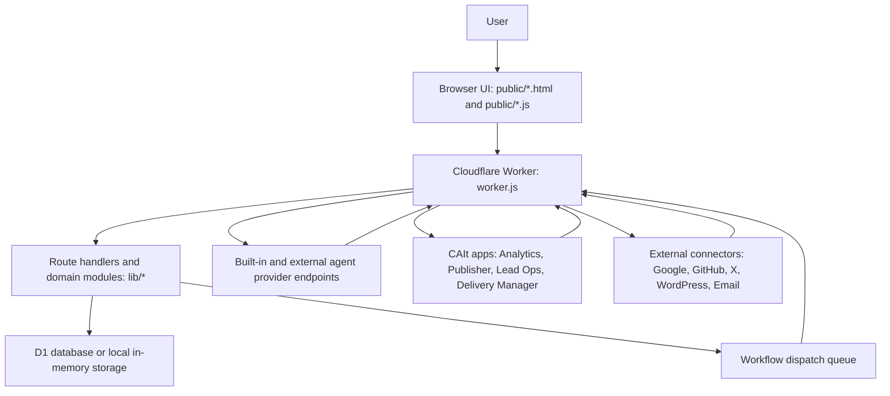
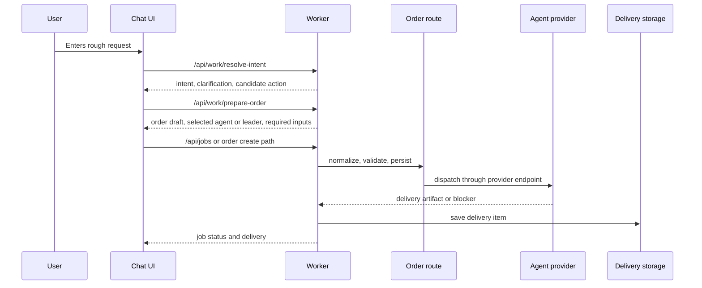
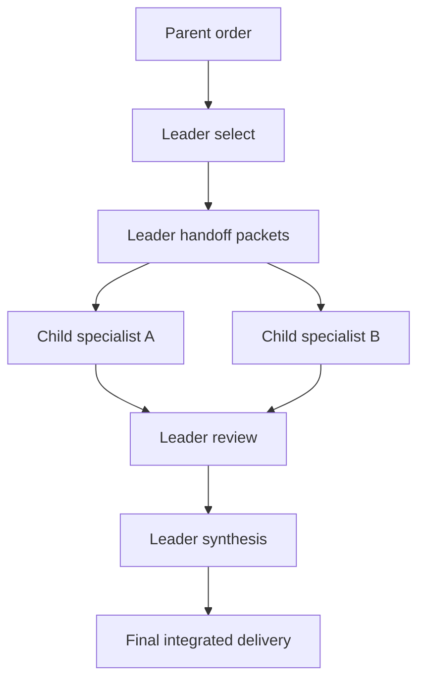
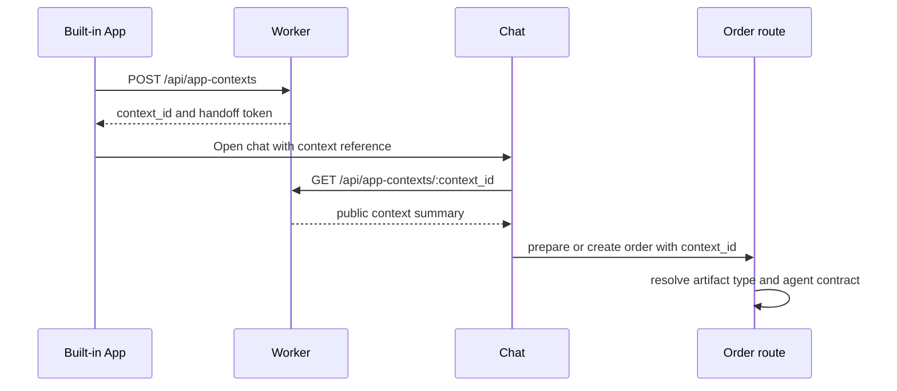
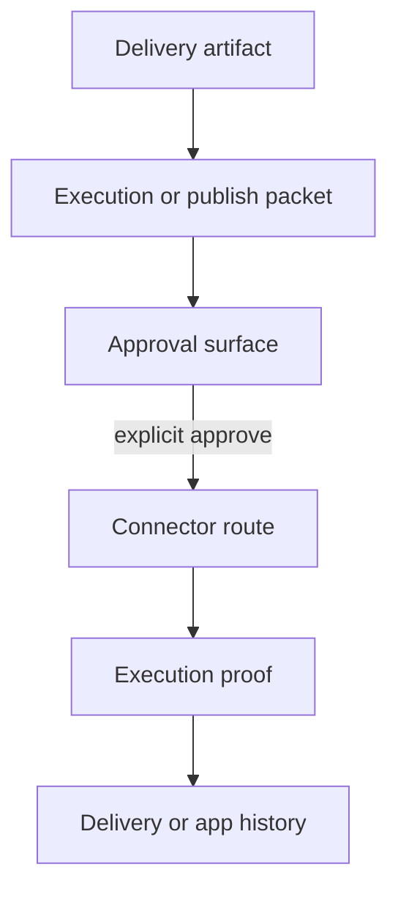

# CAIt / aiagent2 Engineering Deep Dive

This document is the primary engineering guide for people reading, modifying, or contributing to CAIt / aiagent2 as an open-source project.

The README explains the product. This document explains the implementation model: what the service is, why it exists, where responsibilities live, which boundaries must be preserved, and how to change the system without weakening user value or safety.

## 1. Product Definition

CAIt turns a user's rough intent, question, idea, or work request into a safe, reviewable AI-agent work order. It routes that order to the right specialist agent or leader agent, returns concrete delivery artifacts, preserves approval state, and carries the result forward into the next app, review step, schedule, or follow-up order.

CAIt is not just a chat UI. It is a work-order, execution, delivery, approval, scheduling, and app-handoff runtime for AI-agent work.

## 2. Core User Value

The value of CAIt is that users can get high-quality AI-agent output without becoming AI-operations experts.

Most AI tools force the user to do too much:

- Decide exactly how to brief the model.
- Pick the right agent, model, or workflow.
- Review partial output for quality.
- Preserve business context across sessions.
- Decide when external actions are safe.
- Reuse previous deliveries, approvals, analytics, leads, files, or next actions.

CAIt reduces that burden:

- Chat helps shape a vague request into a work order.
- Leader agents select specialists, pass context, review outputs, and synthesize the final result.
- SaaS-style apps make analytics, leads, drafts, approvals, delivery status, and reusable context visible.
- External actions such as posting, sending, publishing, and repository writes stay approval-gated.
- Delivery history is saved so the next order can continue from real business context.
- Scheduled orders can keep recurring work moving while remaining visible and stoppable.

Features that do not improve trustworthy ordering, safe execution, reviewable delivery, or practical handoff are lower priority.

## 3. Current Product Posture

The short-term product is a CAIt-operated AI-agent service that is open source.

Current posture:

- CAIt sells or provides AI-agent services directly.
- Open marketplace operations are not the short-term default.
- External agents and apps can still be reviewed or registered as capabilities, but automated external-provider monetization is not the current product center.
- In-app payment processing has been removed.
- Cards, checkout, subscriptions, invoices, provider payout, and automated revenue split must not be reintroduced without a new explicit payment design.
- Donations are not processed inside CAIt.
- API, CLI, and MCP surfaces are active on the public deployment through explicit runtime flags; private context and write actions remain behind CAIt session/API-key auth.

The shared discipline document is `docs/AGENT_ORCHESTRATION_DISCIPLINE.md`. Treat it as the rulebook. Treat this document as the implementation guide that explains how the rulebook maps to the repository.

## 4. Architecture Overview

Production runs on Cloudflare Workers. Local Node.js development uses a thin adapter that delegates to the same Worker fetch handler.



Primary responsibility boundaries:

| Layer | Representative files | Responsibility |
| --- | --- | --- |
| Worker entry | `worker.js` | HTTP entry, API routing, auth, cron, queue handling, static assets, production bindings. |
| Node adapter | `server.js` | Local development adapter. Converts local HTTP requests to Fetch `Request` objects and delegates to `worker.fetch()`. |
| Route/domain modules | `lib/*` | Storage, order creation, orchestration contracts, agents, apps, connectors, delivery, settings, shared policies. |
| Built-in agents | `lib/builtin-agents/agents/*` | Agent-specific manifests, prompts, provider behavior, leader behavior, output contracts. |
| Browser UI | `public/*` | Chat, apps, settings, delivery views, app bridge, and client-side rendering. |
| QA scripts | `scripts/*-qa.mjs`, `e2e/*` | Discipline checks, architecture checks, Worker/API checks, E2E tests. |
| Docs | `README.md`, `docs/*` | Product explanation, engineering rules, security posture, handoff notes. |

## 5. Runtime Environments

### 5.1 Production

Production is a Cloudflare Workers deployment.

| Item | Value |
| --- | --- |
| Worker entry | `worker.js` |
| Cloudflare config | `wrangler.jsonc` |
| Static assets | `public/` |
| Database binding | `MY_BINDING` |
| Queue binding | `WORKFLOW_DISPATCH_QUEUE` |
| Cron triggers | `* * * * *`, `*/15 * * * *` |

The Worker owns:

- static asset responses
- authentication session handling
- API route handling
- job and order creation
- workflow parent and child job state
- recurring order sweeps
- delivery item persistence
- connector OAuth and external write flows
- built-in agent provider endpoints
- dispatch to external agent endpoints
- app context handoff

### 5.2 Local Node Adapter

`server.js` exists for local development, local E2E, and debugging.

Rules for `server.js`:

- Do not add production business logic to it.
- Do not reimplement API routes in it.
- It should build Fetch `Request` objects and delegate to `worker.fetch()`.
- Keep it limited to local compatibility: static asset binding, local queue binding, test bootstrap, and local-only bridges.
- API behavior should remain owned by `worker.js` and `lib/api-routes.js`.

## 6. Core Domain Model

### 6.1 User, Account, Session

Users interact with CAIt through accounts and sessions. These sessions control orders, settings, app context, delivery history, and connector access.

Related concepts:

- email login
- auth session
- provider identity
- settings profile
- API key settings
- connector identity
- admin dashboard

External apps and future OAuth/OIDC flows must not receive the CAIt session cookie directly. Use short-lived handoff tokens, server-side app context IDs, or a future delegation token.

### 6.2 Agent

An agent is the execution unit that performs work.

Agent categories:

- built-in sample agent
- CAIt-managed agent
- registered external agent
- leader agent

Agent rules:

- Built-in and external agents must share the same provider endpoint contract.
- Sample agents must not get a special same-worker execution path.
- Agent-specific output shape, approval wording, task specific definitions, and delivery templates belong in the agent definition.
- `worker`, `orchestration`, and client code must not accumulate agent-specific work definitions.

### 6.3 Leader Agent

A leader agent coordinates specialist agents. It does not replace them.

Leader control loop:

1. select
2. handoff
3. review
4. synthesize

Leader responsibilities:

- clarify the user's objective
- choose the smallest useful specialist set
- pass objective, constraints, source inputs, required outputs, and acceptance checks
- verify that specialists used the handoff
- check specificity, evidence, and actionability
- resolve conflicts
- produce the final integrated delivery
- prepare approval-gated execution packets when appropriate

Leader non-responsibilities:

- doing every specialist task alone
- executing OAuth or API writes directly
- hiding weak specialist output inside a generic summary
- advancing to external action without evidence and approval

### 6.4 Job and Order

A job or order is the persisted representation of user work.

Common states:

- draft or prepared
- pending or queued
- running
- waiting for approval or authority
- completed
- failed
- timed out
- scheduled or recurring

The main order creation module is `lib/routes/order-create.js`. It normalizes payloads, validates intake, resolves agents, creates single jobs or workflows, records accounting telemetry, and schedules dispatch.

### 6.5 Workflow Parent and Child Jobs

Leader workflows use parent and child jobs.

Parent job:

- user-facing order
- leader orchestration state
- overall workflow status
- final integrated delivery

Child job:

- specialist execution unit
- receives leader handoff
- returns specialist output and downstream summary

Child assignment must be resolved from the current agent list and manifest/task contract. Do not trust a stale concrete agent ID when the current resolver says a different active agent owns the task.

### 6.6 Delivery

A delivery is the user-facing result returned by an agent/provider.

Delivery rules:

- Only values returned by the agent/provider contract can be treated as delivery artifacts.
- Worker, chat, client, and delivery views must not synthesize replacement delivery files.
- If the agent output is missing, generic, templated, unrelated, or not a concrete artifact, retry within budget and then fail.
- If a leader produces a final integrated delivery, prioritize that final artifact; keep supporting specialist memos in run summaries or history.

### 6.7 App

Apps are SaaS-style surfaces outside chat. They make work visible and reusable.

Built-in apps include:

- Analytics Console
- Publisher & Approval Studio
- Lead Ops Console
- Campaign Operations
- Ads Launch Console
- Pricing Decision Console
- Delivery Manager

Apps are not launch buttons. They display, structure, and preserve context so the next agent order starts from real business state.

### 6.8 App Context

App context is structured context handed from an app to chat or order creation.

Rules:

- Do not treat large browser `localStorage` payloads as canonical state.
- Persist app context as a server-side record through `POST /api/app-contexts`.
- Pass only a context reference into chat.
- Do not give external apps the CAIt session cookie.
- Preserve TTL, public summary, and private token boundaries.

### 6.9 Connector

Connectors integrate with external services such as Google, GitHub, X, WordPress, Resend/email, and Instagram.

Connector rules:

- OAuth token storage, refresh, scopes, and account linking belong to CAIt core.
- Built-in apps must not create app-specific OAuth clients.
- Posting, sending, publishing, PR creation, and repository writes require approval gates.
- Ambiguous chat approval is not enough for external writes.
- Do not show an action as executed until the connector returns proof.

### 6.10 Recurring Order and Schedule

Recurring orders let users run repeated work in the background.

Current scheduling policy:

- When the user expresses an acquisition or marketing intent, chat should ask whether they want automation.
- If not automated, create a normal one-time order.
- If automated, ask for count or schedule.
- Prefer `scheduled` work that users can stop over indefinite "waiting for confirmation" loops.
- Save each run result into delivery history so future work can continue from it.

## 7. Representative Flows

### 7.1 Normal Chat Order



Chat should help with input, display order drafts, poll status, show deliveries, and offer app handoff. It must not create specialist-specific artifacts or invent routing that belongs to leader or agent definitions.

### 7.2 Leader Workflow



Leader workflow requirements:

- preserve specialist selection reasons
- include objective, constraints, source inputs, required outputs, and acceptance checks in handoff packets
- pass downstream handoff summaries between stages
- resolve duplicate or conflicting specialist findings
- hand execution packets to approval-gated surfaces

### 7.3 App Context to Order



App handoff completion must be based on explicit artifact metadata and app ingest/list routes or connector proof. Do not parse Markdown body text to recover app intent.

### 7.4 External Write



Examples of external writes:

- X post
- Gmail send
- Resend email
- WordPress draft or publish action
- GitHub PR or repository write
- Instagram post

Required properties:

- the agent/provider returns an explicit execution packet or authority request
- the UI displays approval state
- the connector returns proof
- proof is saved before the UI claims execution

## 8. Key File Map

### 8.1 Entry and Runtime

| File | Purpose |
| --- | --- |
| `worker.js` | Cloudflare Worker entry. Owns API entry, auth, cron, queue handling, static responses, connectors, and agent dispatch entry. |
| `server.js` | Node local adapter. Delegates to `worker.fetch()`. |
| `wrangler.jsonc` | Cloudflare bindings, routes, cron, assets, queue configuration. |
| `package.json` | npm scripts, dependencies, license metadata. `private: true` prevents npm publishing and does not conflict with a public GitHub repository. |

### 8.2 API and Domain

| File | Purpose |
| --- | --- |
| `lib/api-routes.js` | Canonical API route manifest: paths, methods, runtime availability. |
| `lib/http-policy.js` | CSRF, unsafe method handling, rate-limit policy, shared HTTP rules. |
| `lib/routes/order-create.js` | Central order/job creation module. |
| `lib/shared.js` | Shared domain logic for agent/task inference, accounts, orders, recurring work, and legacy cost/accounting concepts. |
| `lib/storage.js` | D1 and in-memory storage abstraction, schema, seed, initialization compatibility. |
| `lib/orchestration.js` | Leader contracts, handoff summaries, quality checks, workflow profiles. |
| `lib/agent-catalog-index.js` | Catalog summaries used by leaders when selecting candidate agents. |
| `lib/delivery-completion-gate.js` | Mechanical gate for delivery completion evidence. |
| `lib/manifest.js` | External agent manifest normalization, validation, and safety checks. |
| `lib/apps.js` | App manifest registry and app-domain helpers. |
| `lib/app-context.js` | App context normalization, TTL, public summary, token handling. |
| `lib/external-write-confirmation.js` | Shared external-write confirmation type handling. |

### 8.3 Built-in Agents

| Path | Purpose |
| --- | --- |
| `lib/builtin-agents/agents/index.js` | Built-in agent definition registry. |
| `lib/builtin-agents/agents/*` | Agent-specific definitions, manifests, prompts, provider behavior, leader behavior. |

Agent-specific rules belong in agent definitions:

- intake questions
- deliverable requirements
- output shape
- task dispatch allowlists
- workflow layers
- connector execution policies
- approval wording
- app-review packet requirements

### 8.4 Browser UI

| File | Purpose |
| --- | --- |
| `public/chat.html` | Chat shell. |
| `public/chat.js` | Chat UI controller: intake, order drafts, polling, delivery rendering, app handoff UI. |
| `public/chat-engine.js` | Mostly pure chat/order helper logic. |
| `public/app-manifest-registry.js` | Built-in app manifest and workspace grouping. |
| `public/cait-app-bridge.js` | Shared bridge from CAIt apps back to chat context. |
| `public/analytics-console.js` | Analytics Console controller. |
| `public/publisher-approval.js` | Publisher & Approval Studio controller. |
| `public/lead-ops.js` | Lead Ops Console controller. |
| `public/delivery-manager.js` | Delivery Manager controller. |
| `public/app-console.css` | Shared console styling for built-in apps. |

Keep app-specific state, tables, connector controls, and context-building logic inside the matching app file.

## 9. API Surface

The canonical API route list is `lib/api-routes.js`. When adding a route, update the manifest, allowed methods, runtime availability, handler, auth/CSRF policy, and QA coverage.

Major route groups:

| Group | Representative endpoints |
| --- | --- |
| Health and metadata | `/api/health`, `/api/ready`, `/api/version`, `/api/schema`, `/api/stats` |
| Work intent/order | `/api/work/resolve-intent`, `/api/work/prepare-order`, `/api/work/preflight-order`, `/api/jobs` |
| Jobs | `/api/jobs`, `/api/jobs/:id`, `/api/agent-callbacks/jobs` |
| Deliveries | `/api/delivery-items`, `/api/deliveries/classify`, `/api/deliveries/prepare-followup-order`, `/api/deliveries/execute`, `/api/deliveries/schedule` |
| Agents | `/api/agents`, `/api/agent-catalog-index`, `/api/agent-selection-index`, `/api/agents/import-manifest`, `/api/agents/import-url` |
| Apps | `/api/apps`, `/api/apps/import-manifest`, `/api/apps/import-url`, `/api/app-contexts`, `/api/app-contexts/:context_id` |
| Connectors | `/api/connectors/google/*`, `/api/connectors/x/*`, `/api/connectors/wordpress/*`, `/api/connectors/resend/*`, `/api/connectors/instagram/*` |
| Publisher | `/api/publisher/items`, `/api/publisher/context-ingest`, `/api/publisher/campaign-ingest` |
| Campaigns | `/api/campaigns`, `/api/campaigns/:campaign_id/*` |
| GitHub | `/api/github/repos`, `/api/github/import-repo`, `/api/github/create-adapter-pr`, `/api/github/create-executor-pr` |
| Settings | `/api/settings`, `/api/settings/profile`, `/api/settings/api-keys`, `/api/settings/app-settings`, `/api/settings/executor-preferences` |
| Admin | `/api/admin/dashboard`, `/api/admin/api-keys`, `/api/admin/provider-identities/:login` |
| Dev/internal | `/api/dev/dispatch-retry`, `/api/dev/recurring-sweep`, `/api/dev/resolve-job`, `/api/dev/timeout-sweep`, `/api/internal/cron/workflow-completions` |

`/api/billing-audits` may still exist, but it is not a payment feature. Treat it as cost/accounting/audit telemetry and compatibility surface.

## 10. Order and Job Creation

### 10.1 Entry Points

Orders can be created from:

- chat
- app context
- delivery follow-up
- recurring schedule execution
- dev/test paths

Shared expectations:

- Normalize inputs on the server.
- Validate selected agent/leader against manifests and task contracts.
- Pass app context and delivery references as IDs, then load server-side records.
- Do not directly execute external writes during order creation.
- Save schedules as recurring orders that can be paused or stopped.

### 10.2 Cost and Accounting Telemetry

Payment processing has been removed. Some legacy names such as `billing`, `reservation`, `cost`, or `audit` may remain for compatibility, cost tracking, or order limits.

Current meaning:

- no customer charge
- no provider payout
- no card handling
- no checkout
- no subscription
- no invoice
- no donation processing inside CAIt

Flags such as `donation_only` or `paymentProcessingRemoved` mean that payment movement is not performed.

When changing this area:

- do not add payment UI copy
- do not add payment-provider SDK imports
- do not add checkout, saved cards, invoices, subscriptions, or payout routes
- prefer renaming old concepts toward cost audit or usage audit when safe

### 10.3 Delivery Validation

An agent/provider result should fail if it is:

- empty
- generic
- templated
- unrelated to the user request
- missing concrete artifacts
- missing required source evidence
- missing required app-handoff metadata

The Worker must not synthesize a substitute delivery to make the order look successful.

## 11. Leader Orchestration Contract

The shared leader contract lives in `lib/orchestration.js`.

### 11.1 Control Stages

| Stage | Responsibility | Required output |
| --- | --- | --- |
| select | Choose the smallest useful set of specialists. | selected_specialists, selection_reason, deferred_specialists |
| handoff | Pass objective, constraints, source inputs, required outputs, acceptance checks. | objective, constraints, source_inputs, required_outputs, acceptance_checks |
| review | Verify each specialist used the handoff and returned specific, evidence-backed, actionable output. | input_used, specificity, evidence_status, actionability, missing_items |
| synthesize | Resolve conflicts, choose the next lane, create final summary, prepare approval-gated execution packets. | integrated_decision, conflicts_resolved, next_lane, approval_or_execution_packet |

### 11.2 Quality Checks

Shared quality checks:

- `handoff_input_used`
- `specific_not_generic`
- `evidence_before_action`
- `approval_before_external_write`
- `synthesis_resolves_conflict`

These are shared orchestration boundaries. Do not turn `lib/orchestration.js` into a registry of agent-specific special cases.

### 11.3 Downstream Handoff Summary

Specialists should return a short structured summary for downstream agents, leaders, or SaaS surfaces.

Fields:

- decision
- inputs_used
- verified_facts
- assumptions_or_gaps
- artifact_for_next_agent
- blockers
- next_inputs
- recommended_next_owner

Do not include:

- full report duplicates
- Worker logs
- internal reasoning
- raw source dumps
- vague text that forces the next surface to infer metadata from prose

## 12. App and Workspace Model

### 12.1 Built-in App Registry

The built-in app registry is centered around `public/app-manifest-registry.js`.

Workspace examples:

- Growth Publisher Workspace
- Campaign Control Workspace
- Analytics Measurement Workspace
- Pricing Decision Workspace

Delivery Manager is a CAIt core feature, not a normal app marketplace surface.

Some ops apps may be hidden as standalone apps and reached through a workspace.

### 12.2 App Manifest

App manifests should define:

- app ID
- title and description
- capabilities
- required connectors
- approval requirements
- input contract
- context contract
- tags
- direct command aliases
- MCP status

App handoff must be based on manifest contracts and artifact metadata. Do not infer app eligibility from delivery body text.

### 12.3 App Code Boundary

Each built-in app keeps app-specific browser code in its own JavaScript file.

Why this matters:

- one app can change without shipping unrelated app behavior
- QA can target the affected app
- app context contracts remain traceable
- future externalization becomes easier

Shared code may include:

- app bridge
- common CSS
- navigation
- generic fetch helpers
- generic UI helpers

Shared code should not include:

- app-specific table models
- app-specific connector state
- app-specific order prompts
- app-specific approval text
- app-specific artifact metadata inference

## 13. Connector and Approval Model

### 13.1 Principle

External writes are risky operations.

Examples:

- social posting
- email sending
- WordPress publishing
- GitHub PR or repository write
- ad or campaign creation
- anything visible to third parties
- anything that changes external account state
- anything that can spend money

External writes require:

- explicit execution packet
- approval or authority request
- connector readiness check
- connector response proof
- persisted history

### 13.2 Chat Responsibility

Chat can display the approval flow. It is not the final authority surface for external writes.

Chat may:

- explain missing connector state
- display approval requirements
- hand off to an app
- show drafts
- poll status

Chat must not:

- execute external writes from ambiguous natural-language approval
- generate publish packets that the agent/provider did not return
- parse delivery bodies to construct publish metadata
- claim completion without connector proof

## 14. Scheduling and Marketing Automation

CAIt should evolve toward automated marketing execution loops, but with safety boundaries intact.

### 14.1 Intent Branching

When the user expresses goals such as:

- "I want more traffic"
- "I want to attract leads"
- "Create articles continuously"
- "Keep social posts running"
- "Review analytics every week"
- "Improve campaigns on a schedule"

Chat should ask whether the user wants automation.

Branches:

- no automation: create a normal one-time order
- automation: ask for count or schedule

### 14.2 Scheduled Policy

Prefer a `scheduled` state that users can stop over a passive "waiting for confirmation" state.

Required surfaces:

- next run time
- run count
- stop or pause control
- delivery history
- latest result
- waiting approval items
- connector issues

### 14.3 Automation and External Writes

Automation may safely perform:

- analysis
- draft creation
- lead candidate organization
- post idea generation
- landing-page recommendations
- reports
- approval queue preparation

Automation needs approval before:

- public posting
- sending email
- creating PRs
- changing production sites
- launching ads
- moving money

Implement automation as stoppable scheduled work plus approval-gated external writes.

## 15. Payment and Donation Policy

### 15.1 Removed and Not Allowed

Do not add back:

- PAY.JP
- Stripe Checkout
- Stripe Customer or saved card handling
- subscriptions
- invoices
- card setup
- provider payout onboarding
- automated provider revenue split
- platform payout movement
- donation processing inside CAIt

### 15.2 Donations

Stripe can be used for donations in some contexts, but CAIt currently does not process donations inside the app.

If a donation path is considered later:

- do not handle cards inside CAIt
- do not bind donation completion to order execution
- keep it separate from agent work authorization
- use an external page or provider-hosted link
- review legal, accounting, platform, and public-copy requirements first

## 16. Security and Open-source Posture

The publication audit is documented in `SECURITY_PUBLICATION_AUDIT.md`.

Core rules:

- Do not commit real secrets.
- Do not commit `.env`, local token files, or secret-bearing config.
- Avoid fake keys that look like real keys.
- Do not place OpenAI, GitHub, Cloudflare, Google, AWS, Stripe, or webhook secret patterns directly into test fixtures.
- Public metadata, binding names, and empty placeholders are acceptable; values are not.

Secret handling:

- Use `wrangler secret put` for Cloudflare secrets.
- Put local E2E secrets in ignored files such as `.env.e2e.local`.
- Do not include real-looking key samples in docs.
- Use placeholder text such as `replace-with-your-key`.

Public metadata:

- `package.json` may remain `private: true` to prevent npm publishing.
- The repository license is `AGPL-3.0-or-later`.
- Contributors should understand AGPL, security, and payment-removal posture before making broad changes.

## 17. Development Setup

Install dependencies:

```bash
npm install
```

Run the Worker-oriented local environment:

```bash
npm run dev
```

Run the Node adapter for local smoke or E2E workflows:

```bash
npm run dev:node-ephemeral
```

Environment rules:

- Do not commit `.env` files.
- Do not write real API keys into docs or tests.
- Keep provider OAuth app secrets in deployment secrets.
- Use test-only auth secrets for E2E.

## 18. Storage

`lib/storage.js` is the storage boundary for D1 and local in-memory storage.

When changing storage:

- support D1 and in-memory storage
- update seed data if needed
- tolerate old records with missing fields
- update normalizers and public sanitizers
- consider migration compatibility
- update QA coverage

Common state categories:

- agents
- jobs
- events
- accounts
- API keys
- feedback reports
- chat transcripts
- email deliveries
- exact match actions
- recurring orders
- apps
- app settings
- app contexts
- delivery items

## 19. QA

Run QA based on the affected area.

Minimum checks for broad changes:

```bash
npm run qa:discipline
npm run qa:architecture
npm run qa:open-core
```

Worker/API changes:

```bash
npm run qa:worker-api
```

Leader workflow changes:

```bash
npm run qa:leader-workflows
```

Production E2E:

```bash
npm run qa:e2e:prod -- --require-auth
```

External write tests must remain opt-in. Use explicit flags for tests that can post, send, publish, or write to a repository.

## 20. Change Rules

### 20.1 Adding a Route

1. Add the path to `lib/api-routes.js`.
2. Add allowed methods.
3. Add runtime availability.
4. Add or update the handler.
5. Check auth, CSRF, unsafe method policy, and rate limits.
6. Add or update QA coverage.

### 20.2 Adding an Agent

1. Add an agent definition.
2. Define manifest task, input, output, approval, and connector needs.
3. Implement through the provider endpoint contract.
4. Treat sample and external agents equivalently.
5. Do not add agent-specific branches to worker or chat.

### 20.3 Adding a Leader

1. Put `leaderBehavior` and `workflowProfile` in the agent definition.
2. Define layers, task allowlists, blocked dispatch task types, and connector policy.
3. Put intake questions in the leader definition.
4. Define specialist review and final synthesis expectations.
5. Do not add leader-specific special cases to `lib/orchestration.js`.

### 20.4 Adding an App

1. Define the app manifest.
2. Specify capabilities, input contract, context contract, and required connectors.
3. Keep app-specific browser code in a dedicated file.
4. Save app context through `POST /api/app-contexts`.
5. Pass context references to chat.
6. Use explicit artifact metadata for app handoff.

### 20.5 Adding a Connector

1. Keep OAuth and token storage in CAIt core.
2. Provide a connector readiness path.
3. Require approval proof for external write endpoints.
4. Persist execution proof.
5. Do not expose tokens to apps or chat.

### 20.6 Changing UI

1. Preserve chat/app responsibility boundaries.
2. Keep app-specific state out of shared bundles.
3. Do not infer metadata from delivery body text.
4. Display scheduled, waiting approval, failed, and completed states distinctly.
5. Do not restore payment, purchase, payout, or checkout copy.

### 20.7 Touching Legacy Billing Names

Treat legacy billing names as candidates for cleanup, not as payment infrastructure.

When you find one:

- verify that no money movement exists
- check that UI does not present it as charging
- ensure payment-provider SDKs, env names, routes, and copy are not reintroduced
- prefer cost audit, usage audit, or order accounting naming when safe

## 21. Common Boundary Failures

### 21.1 Chat Becomes Too Smart

Symptoms:

- `public/chat.js` gains SEO, social, lead, or landing-page specific prompts.
- Chat parses delivery text to build app metadata.
- Chat re-infers agent type from clarification prose.
- Chat triggers connector actions without approval proof.

### 21.2 Worker Gains Agent-specific Knowledge

Symptoms:

- `worker.js` gains task name regex branches for a specific specialist.
- Task specific output templates live in Worker code.
- Sample agents get special execution paths.

### 21.3 App Handoff Uses Body-text Guessing

Symptoms:

- Markdown headings are parsed to recover title, CTA, SEO fields, or destination metadata.
- A generic supporting memo is treated as a final app artifact.
- Apps are shown because body text contains a keyword instead of explicit metadata.

### 21.4 Payment Comes Back Accidentally

Symptoms:

- Stripe or PAY.JP SDK imports return.
- Checkout routes return.
- Subscription, invoice, or payout copy appears in UI.
- Agent registration assumes provider revenue share.

### 21.5 Secrets Enter the Public Repository

Symptoms:

- real-looking OpenAI secret-key samples
- real-looking GitHub personal access token samples
- PEM private key blocks
- Cloudflare API tokens
- Google OAuth secrets

## 22. Recommended Reading Order

New contributors should read:

1. `README.md`
2. `docs/ENGINEERING_DEEP_DIVE.md`
3. `docs/AGENT_ORCHESTRATION_DISCIPLINE.md`
4. `SECURITY_PUBLICATION_AUDIT.md`
5. `lib/api-routes.js`
6. `lib/orchestration.js`
7. `lib/routes/order-create.js`
8. `public/chat.js`
9. the specific app or agent definition being changed

## 23. Known Transitional Areas

The repository includes history and compatibility from marketplace and payment-removal work.

Contributors should know:

- old docs or names may still mention billing, payout, or marketplace concepts
- payment processing should not be restored
- `worker.js` and some client files are still large
- file splitting should be based on real ownership boundaries, not superficial relocation
- QA emphasizes discipline violations
- API, CLI, and MCP are external developer surfaces that stay behind explicit runtime flags and authentication boundaries

## 24. Engineering Priority Order

When in doubt, choose the option that best preserves:

1. the user's path from rough intent to high-quality output
2. safe approval-gated external actions
3. clear agent, leader, app, connector, worker, and client ownership
4. delivery artifacts that come from agent/provider contracts
5. reusable delivery history, app context, and scheduled work
6. public repository safety with no secrets or real-looking keys
7. payment-removal posture
8. QA that continues to catch responsibility leaks

## 25. One-sentence Engineering Direction

CAIt development should strengthen the flow that turns user intent into safe work orders, lets an agent team produce evidence-backed deliverables, protects external actions with approval boundaries, and makes each result reusable for the next business action.
