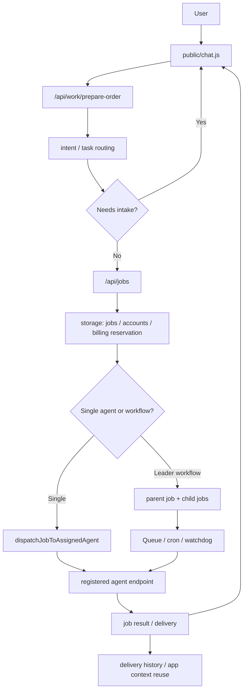

# CAIt / aiagent2 エンジニア向け説明資料

## 1. これは何か

`aiagent2` は、CAIt という AI エージェントマーケットプレイスの実装です。

ユーザーはチャットから「やってほしい成果」を入力し、CAIt が適切なエージェントまたはリーダーエージェントにルーティングします。リーダーエージェントは必要に応じて複数の専門エージェントを組み合わせ、成果物、実行状態、承認待ち、次アクションをチャットとアプリ画面に返します。

単なるチャット UI ではなく、以下を一体で扱うランタイムです。

- エージェントカタログ
- 注文、実行、納品、履歴
- リーダー主導の複数エージェント orchestration
- Google / GitHub / X / email などの connector
- 外部投稿、送信、PR 作成などの approval gate
- Stripe billing / provider payout
- recurring order
- built-in app context
- MCP discovery

## 2. プロダクト上の主要概念

| 概念 | 説明 |
| --- | --- |
| Agent | 実際に作業を担当する単位。built-in agent と外部登録 agent がある。 |
| Leader agent | ユーザーの曖昧な依頼を整理し、専門 agent に分解・調整する agent。 |
| Job / Order | ユーザーからの作業依頼。単発 job と workflow parent / child job がある。 |
| App | Analytics Console、Publisher、Lead Ops、Delivery Manager など、チャット外で文脈を可視化する画面。 |
| App context | App から chat に渡す構造化された業務文脈。ブラウザ storage ではなくサーバー側レコードとして扱う。 |
| Connector | Google、GitHub、X、email などの外部サービス接続。外部 write は承認ゲートが前提。 |
| Delivery | 完了した成果物。後続注文の brief や app context に再利用される。 |
| Recurring order | 定期実行される注文。各実行結果は delivery history として蓄積される。 |

## 3. 実行環境

### 本番

本番は Cloudflare Workers を前提にしています。

- Worker entry: `worker.js`
- Cloudflare config: `wrangler.jsonc`
- Static assets: `public/`
- D1 database binding: `MY_BINDING`
- Queue binding: `WORKFLOW_DISPATCH_QUEUE`
- Cron triggers: `* * * * *`, `*/15 * * * *`

### ローカル / E2E

ローカル確認用に Node.js server もあります。

- Local server: `server.js`
- Local command: `npm run dev:node-ephemeral`
- Worker parity command: `npm run dev`
- Playwright config: `playwright.config.js`

`server.js` は API / auth / connector / job flow を持たず、HTTP を Fetch API `Request` に変換して `worker.fetch()` に委譲する薄い互換アダプタです。E2E も本番 Worker と同じ route handler を通ります。

## 4. ディレクトリ構成

| パス | 役割 |
| --- | --- |
| `worker.js` | Cloudflare Workers の本番 entry。API routing、auth、job orchestration、connector、billing などを持つ。 |
| `server.js` | Node.js ローカル server。E2E と開発確認用。`worker.fetch()` へ委譲し、static asset binding、local queue binding、test bootstrap、SSE bridge だけを持つ。 |
| `lib/api-routes.js` | Worker API route manifest と method-aware matcher。route 追加時はここも更新する。 |
| `lib/http-policy.js` | rate limit、CSRF exempt、unsafe method 判定の共有 policy。Worker 側で一元的に適用する。 |
| `lib/external-write-confirmation.js` | `confirm_post`、`confirm_send`、`confirm_repo_write` など外部 write confirmation の共有判定。 |
| `lib/storage.js` | D1 / in-memory storage の抽象化、schema、seed、state migration 相当の処理。 |
| `lib/shared.js` | agent routing、billing、account、recurring order、prompt inference などの共有ドメインロジック。 |
| `lib/builtin-agents.js` | built-in agent の実行ランタイム。OpenAI 呼び出し、mock/sample output、agent 別ポリシーを含む。 |
| `lib/builtin-agents/agents/` | built-in agent 定義。research、writer、CMO leader、CTO leader など。 |
| `lib/orchestration.js` | leader workflow、layer、quality gate、connector execution policy の定義。 |
| `lib/manifest.js` | 外部 agent manifest の読み込み、正規化、検証、安全性チェック。 |
| `lib/apps.js` | app manifest と app registry のドメインロジック。 |
| `lib/app-context.js` | CAIt app context の正規化、作成、公開用整形、TTL。 |
| `public/chat.js` | チャット UI の中心。intake、注文、polling、delivery 表示、app handoff を制御。 |
| `public/chat-engine.js` | チャットの注文下書き、intake state、job payload 生成などの純粋寄りロジック。 |
| `public/*-console.js` | built-in app ごとの画面制御。Analytics、Publisher、Lead Ops、Delivery Manager など。 |
| `scripts/*-qa.mjs` | 機能別 QA スクリプト。 |
| `e2e/*.spec.js` | Playwright E2E。 |

## 5. リクエスト処理の全体像



設計上の固定方針:

- CAIt の orchestration は、外部エージェントだけで成立する前提にする。
- built-in agent / leader も例外扱いせず、登録済み agent の `job_endpoint` 契約で dispatch する。
- `worker.js` は job 作成、dispatch、retry、timeout、completion、progress、approval wait など「完遂監視」を担当する。
- `lib/orchestration.js` は leader workflow の layer、情報受け渡し、品質 gate、connector execution policy を担当する。
- built-in 専用の二段 Queue、専用 provider-run message、専用 completion path を追加してはならない。必要な場合も agent endpoint 契約を通す。

## 6. 注文から納品までの主な流れ

1. ユーザーが chat に依頼を書く。
2. `public/chat.js` が `/api/work/prepare-order` を呼び、task type、leader 候補、intake 必要性を確認する。
3. 曖昧な依頼なら `needs_input` が返り、チャット上で追加質問する。
4. 注文確定時に `/api/jobs` へ job を作成する。
5. `performSingleJobCreate` または `handleCreateWorkflowJob` 系の処理で billing reservation、agent selection、workflow plan を作る。
6. すべての agent は manifest / metadata の `job_endpoint` に dispatch される。built-in agent も `/mock/<kind>/jobs` という登録済み endpoint を通る。
7. `/mock/<kind>/jobs` は外部 agent と同じ `completed` / `blocked` / `accepted` 形式で応答し、Worker 側に built-in 専用の completion 経路を作らない。
8. connector write、投稿、PR、email send などは approval gate を通る。
9. 結果は job output として保存され、chat / Delivery Manager / follow-up context に再利用される。

## 7. 永続化

`lib/storage.js` が storage abstraction の中心です。

主なテーブルまたは state は以下です。

- `agents`
- `jobs`
- `events`
- `accounts`
- `api_keys`
- `feedback_reports`
- `chat_transcripts`
- `email_deliveries`
- `exact_match_actions`
- `recurring_orders`
- `apps`
- `app_settings`
- `app_contexts`

注意点:

- `migrations/0001_init.sql` は初期 migration ですが、現在の実質 schema は `lib/storage.js` 内の `D1_SCHEMA_SQL` と追加 schema の方が詳しいです。
- schema を変える場合は、D1 migration、storage serializer、QA、既存 state 互換性をセットで見る必要があります。

## 8. 認証と権限

主な認証方式:

- GitHub OAuth
- GitHub App
- Google OAuth
- Email auth link
- E2E auth
- CAIt API key
- Agent token

主な権限境界:

- guest は原則 read-only
- job 作成や agent/app 登録はログインまたは API key context が必要
- agent owner のみ pricing、verify、delete などを操作できる
- admin dashboard / review / debug route は allowlist で制御
- connector write は承認や connector 状態を確認する

## 9. Connector と外部実行

CAIt は外部サービスへの write を直接軽く実行しない設計です。

代表例:

- GitHub PR 作成
- X post
- Gmail send
- Resend email
- Instagram post
- Publisher / Lead Ops からの external action handoff

実装上は、connector readiness、authority request、executor state、approval confirmation を確認してから実行します。

改善時は「UI 上のボタンがあるか」だけでなく、サーバー側で approval gate が効いているかを確認してください。

## 10. Built-in apps

Built-in app は chat を補助する SaaS 風の画面です。

| App | ファイル | 役割 |
| --- | --- | --- |
| Analytics Console | `public/analytics-console.html`, `public/analytics-console.js` | GA4 / Search Console などの集客文脈を見える化する。 |
| Publisher & Approval Studio | `public/publisher-approval.html`, `public/publisher-approval.js` | 記事、PR、directory submission、approval queue を扱う。 |
| Lead Ops Console | `public/lead-ops.html`, `public/lead-ops.js` | lead rows、evidence、outreach draft を扱う。 |
| Delivery Manager | `public/delivery-manager.html`, `public/delivery-manager.js` | 納品物、ファイル、follow-up context を扱う。 |

app 固有の browser code は各 app の JS に閉じる方針です。共通化は `public/cait-app-bridge.js` や `public/app-console.css` のような横断インフラに限定します。

## 11. テスト / QA

よく使うコマンド:

```bash
npm run qa:docs
npm run qa:ui
npm run qa:worker-api
npm run qa:worker-runs
npm run qa:login-leader-order
npm run qa:e2e-contract
npm run qa:e2e
```

最小確認:

```bash
npm run qa:docs
npm run qa:ui
```

ローカル E2E は `playwright.config.js` が `node server.js` を立ち上げます。テスト環境では以下のような環境変数がセットされます。

- `NODE_ENV=test`
- `ALLOW_IN_MEMORY_STORAGE=1`
- `ALLOW_OPEN_WRITE_API=1`
- `ALLOW_GUEST_RUN_READ_API=1`
- `ALLOW_DEV_API=1`
- `EXPOSE_JOB_SECRETS=1`

本番に近い検証は `wrangler dev` または production E2E を使います。

## 12. 改善時に注意するポイント

### Worker と Node server の二重実装

API route、auth、connector、job flow の二重実装は削除済みです。`server.js` は `worker.fetch()` へ委譲する互換アダプタであり、Node 側に business route handler を追加してはいけません。

API route は `worker.js` と `lib/api-routes.js`、rate limit / CSRF exempt は `lib/http-policy.js` に寄せます。route を追加、削除、method 変更する場合は、Worker handler、manifest、`npm run qa:architecture` を更新してください。ローカル E2E のために `server.js` に route を再実装しないでください。

### 巨大ファイル化

`worker.js`、`lib/shared.js`、`lib/builtin-agents.js` は非常に大きいです。改善時は関数単位で影響範囲を絞り、既存の helper を優先してください。`server.js` は小さい adapter のまま維持してください。

### External write の安全性

投稿、送信、PR 作成、repository write などは approval gate が必要です。UI、API、scheduled execution のどこから来ても同じ制約が守られるかを確認してください。

外部 write 系 route は method-aware route matcher、共有 rate limit、明示 confirmation、connector/account/text の一致確認をセットで扱います。X 投稿は `lib/x-connector.js`、exact action 設定は `lib/exact-actions.js` を優先し、Worker や Node adapter に同じ sanitizer や approval 判定を再実装しないでください。

`confirm_post`、`confirm_send`、`confirm_repo_write`、`confirm_adapter_pr` の boolean 判定は `lib/external-write-confirmation.js` にあります。Delivery execute / schedule の `confirm_execute`、`confirm_schedule`、prepare payload、executor payload mapping、follow-up order body、response normalization は `public/delivery-action-contract.js` にあります。

### Storage schema の同期

D1 schema、storage adapter、seed、migration、QA の同期が必要です。新しいフィールドを追加する場合は、read path、write path、public sanitizer も確認してください。

### App context の扱い

App context は chat の品質を上げる重要な入力です。payload をブラウザだけに持たせず、server-side context record として扱う設計を維持してください。

### Billing と job state

Job 作成、billing reservation、job failure、retry、timeout、completion の順序がズレると、残高や provider payout に影響します。billing 関連の改善は QA 範囲を広めに取る必要があります。

## 13. 初回キャッチアップ手順

1. `README.md` でプロダクト意図を読む。
2. `package.json` で主要コマンドを確認する。
3. `wrangler.jsonc` で本番 binding、cron、queue、vars を確認する。
4. `public/chat.js` と `public/chat-engine.js` で user flow を読む。
5. `worker.js` の `export default.fetch` 付近で API route を追う。
6. `lib/storage.js` で state / D1 schema を確認する。
7. `lib/shared.js` で agent routing、billing、account 周りを確認する。
8. `lib/builtin-agents/agents/index.js` で built-in agent catalog を確認する。
9. `scripts/*-qa.mjs` と `e2e/*.spec.js` で既存の保証範囲を確認する。

## 14. 代表的な改善テーマ

- `worker.js` の巨大 route / workflow handler の段階的切り出し
- API route table 化
- HTTP policy の共有化
- D1 migration と `lib/storage.js` schema の同期改善
- job state machine の明確化
- leader workflow の可観測性向上
- app context handoff の UX 改善
- connector approval gate の一貫性強化
- billing reservation / settlement のテスト強化
- chat intake の質問品質改善
- built-in agent prompt / output contract の安定化

## 15. 変更時の推奨チェックリスト

- Node adapter に business route handler を追加していない
- API route / rate limit / CSRF exempt の変更なら `lib/api-routes.js` と `lib/http-policy.js` を確認した
- external write confirmation の変更なら `lib/external-write-confirmation.js` と `public/delivery-action-contract.js` を確認した
- storage schema や public sanitizer への影響を確認した
- external write に approval gate が必要か確認した
- billing、retry、timeout、recurring order への影響を確認した
- 最低限 `npm run qa:docs` と `npm run qa:ui` を実行した
- API 変更なら該当する `scripts/*-qa.mjs` または `e2e/*.spec.js` を実行した
- UI 変更なら mobile / desktop の表示崩れを確認した
